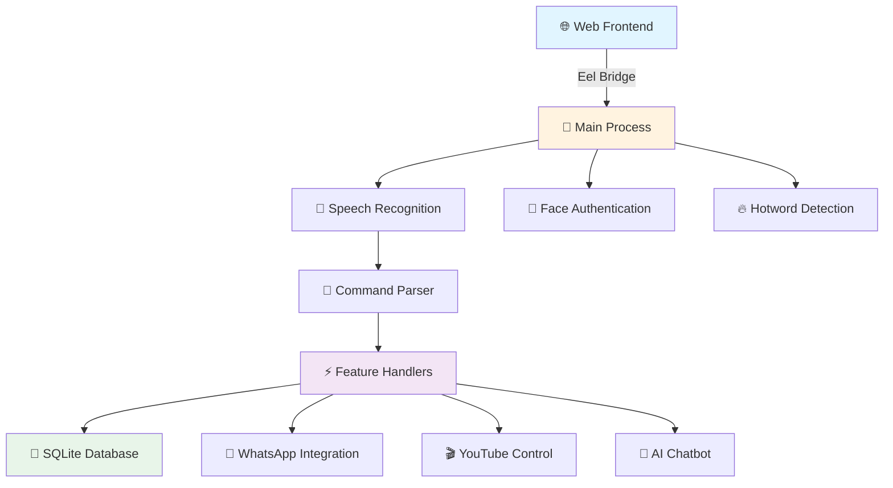

# Keyword-Based News Fetcher

## Description
A Python module that fetches the top news articles for a given keyword using [NewsAPI.org](https://newsapi.org/).  
Features:
- Fetch top 3 news articles (can be changed in script).
- Display title + URL.
- Shortens long URLs for cleaner output.
- Logs fetched news to `news_log.txt`.
- Accepts commands like `show news about AI`.

## Usage
1. Install dependencies:

<div align="center">

# 🤖 Jarvis AI Assistant

### *Your Personal Voice-Controlled AI Companion*

[](https://www.python.org/downloads/)
[](https://opensource.org/licenses/MIT)
[](http://makeapullrequest.com)
[](https://github.com/vannu07/jarvis/stargazers)
[](https://github.com/vannu07/jarvis/network)


*A production-ready voice assistant with facial recognition authentication, built on modern Python architecture and web technologies.*

[Features](#-features) • [Installation](#-installation) • [Usage](#-usage) • [Documentation](#-development) • [Contributing](#-contributing)

---


</div>

## ✨ Features

<div align="center">

| 🎤 Voice Control | 👤 Face Recognition | 🔥 Hotword Detection | 🌐 Web Integration |
|:---:|:---:|:---:|:---:|
| Advanced speech-to-text | Secure biometric auth | Always-on wake word | Modern responsive UI |

</div>

### 🚀 Core Capabilities

<table>
<tr>
<td width="50%">

#### 🎯 Voice & AI
- 🗣️ **Real-time Speech Recognition** using Google STT
- 💬 **Natural Language Processing** with Hugging Face
- 🎵 **Text-to-Speech** with customizable voices
- 🔊 **Audio Visualization** in real-time
- 🎙️ **Wake Word Detection** ("Jarvis", "Alexa")

</td>
<td width="50%">

#### 🔧 Smart Integrations
- 📱 **WhatsApp Automation** (messages, calls, video)
- 🎬 **YouTube Control** via voice commands
- 💻 **System Control** (apps, windows, shortcuts)
- 📞 **Contact Management** with voice lookup
- 🌐 **Web Browsing** through voice

</td>
</tr>
</table>

---

## 🛠️ Tech Stack

<div align="center">

### Backend Technologies


### Frontend Technologies


### AI & ML


### Tools & Libraries


</div>

---

## 🏗️ Architecture

<div align="center">



</div>

---

## 📋 Prerequisites

<table>
<tr>
<td width="50%">

### 🖥️ System Requirements
```yaml
OS: Windows 10/11, Linux, macOS
Python: 3.10+
RAM: 4GB minimum
Storage: 500MB free space
```

</td>
<td width="50%">

### 🔌 Hardware
```yaml
Microphone: Required for voice input
Webcam: Required for face recognition
Internet: Active connection needed
Audio Output: Speakers/Headphones
```

</td>
</tr>
</table>

---

## 🚀 Installation

<details>
<summary><b>📦 Quick Install (Click to expand)</b></summary>

### Step 1️⃣: Clone Repository

```bash
git clone https://github.com/vannu07/jarvis.git
cd jarvis
```

### Step 2️⃣: Setup Virtual Environment

<table>
<tr>
<td width="50%">

**🪟 Windows**
```bash
python -m venv venv
venv\Scripts\activate
```

</td>
<td width="50%">

**🐧 Linux/Mac**
```bash
python3 -m venv venv
source venv/bin/activate
```

</td>
</tr>
</table>

### Step 3️⃣: Install Dependencies

```bash
pip install -r requirements.txt
```

### Step 4️⃣: Configure Environment

Create a `.env` file:

```env
# API Keys
HUGGINGFACE_TOKEN=your_token_here
PORCUPINE_ACCESS_KEY=your_key_here

# Voice Settings
TTS_RATE=150
TTS_VOICE=0

# Recognition Settings
FACE_CONFIDENCE_THRESHOLD=50
HOTWORD_SENSITIVITY=0.5
```

### Step 5️⃣: Train Face Recognition (Optional)

```bash
python backend/auth/trainer.py
```

</details>

<div align="center">

### 🎬 Quick Start

```bash
python run.py
```

**That's it! Jarvis will launch at** `http://localhost:8000` 🚀


</div>

---

## 💡 Usage

### 🎤 Voice Commands

<table>
<tr>
<td width="33%">

#### 🖥️ System Control
```
Jarvis, open Chrome
Jarvis, launch VS Code
Jarvis, close window
Jarvis, shutdown computer
```

</td>
<td width="33%">

#### 🎵 Media Control
```
Jarvis, play Metallica
Jarvis, pause video
Jarvis, next song
Jarvis, volume up
```

</td>
<td width="33%">

#### 📱 Communication
```
Jarvis, message John
Jarvis, call Sarah
Jarvis, video call Mike
Jarvis, open WhatsApp
```

</td>
</tr>
</table>

### ⌨️ Keyboard Shortcuts

<div align="center">

| Shortcut | Action |
|:--------:|:------:|
| `Win + J` (Windows) | Manual Activation |
| `Cmd + J` (macOS) | Manual Activation |
| `Ctrl + Q` | Quit Application |
| `F11` | Fullscreen Toggle |

</div>

### 🎯 Wake Words

Say **"Jarvis"** or **"Alexa"** followed by your command!

<div align="center">

</div>

---

## 📁 Project Structure

```
📦 jarvis/
┣ 📂 backend/
┃ ┣ 📂 auth/
┃ ┃ ┣ 📄 haarcascade_frontalface_default.xml
┃ ┃ ┣ 📄 recognize.py        # 👤 Face recognition
┃ ┃ ┣ 📄 trainer.py          # 🎓 Model training
┃ ┃ ┗ 📂 trainer/            # 💾 Trained models
┃ ┣ 📄 command.py            # 🎯 Command parser
┃ ┣ 📄 config.py             # ⚙️ Configuration
┃ ┣ 📄 db.py                 # 💾 Database ops
┃ ┣ 📄 feature.py            # ⚡ Feature handlers
┃ ┗ 📄 helper.py             # 🛠️ Utilities
┣ 📂 frontend/
┃ ┣ 📂 assets/
┃ ┃ ┣ 📂 audio/              # 🔊 Sound files
┃ ┃ ┣ 📂 img/                # 🖼️ Images & icons
┃ ┃ ┗ 📂 vendor/             # 📚 Third-party libs
┃ ┣ 📄 index.html            # 🌐 Main UI
┃ ┣ 📄 style.css             # 🎨 Styles
┃ ┣ 📄 script.js             # ✨ Particle effects
┃ ┣ 📄 main.js               # 🎮 Core logic
┃ ┗ 📄 controller.js         # 🎛️ Event handlers
┣ 📄 main.py                 # 🚀 Entry point
┣ 📄 run.py                  # 🔄 Launcher
┣ 📄 requirements.txt        # 📦 Dependencies
┗ 📄 jarvis.db              # 💾 SQLite DB
```

---

## 🔧 Development

<details>
<summary><b>🎨 Adding Custom Commands</b></summary>

### 1️⃣ Define Command Pattern

Edit `backend/command.py`:

```python
def parse_command(query: str) -> dict:
    if "my custom action" in query.lower():
        return {
            "action": "custom_action",
            "params": {"param1": "value1"}
        }
```

### 2️⃣ Implement Handler

Edit `backend/feature.py`:

```python
def handle_custom_action(params: dict) -> str:
    # Your implementation here
    result = do_something(params)
    return f"Action completed: {result}"
```

### 3️⃣ Register Command

```python
COMMAND_HANDLERS = {
    "custom_action": handle_custom_action,
    # ... other handlers
}
```

</details>

<details>
<summary><b>💾 Database Schema</b></summary>

```sql
-- 📇 Contacts Table
CREATE TABLE contacts (
    id INTEGER PRIMARY KEY AUTOINCREMENT,
    name TEXT NOT NULL,
    phone TEXT,
    whatsapp TEXT,
    email TEXT,
    created_at TIMESTAMP DEFAULT CURRENT_TIMESTAMP
);

-- 💻 Applications Table
CREATE TABLE apps (
    id INTEGER PRIMARY KEY AUTOINCREMENT,
    name TEXT NOT NULL,
    path TEXT NOT NULL,
    keywords TEXT,  -- JSON array
    icon TEXT,
    created_at TIMESTAMP DEFAULT CURRENT_TIMESTAMP
);

-- 🌐 Web Commands Table
CREATE TABLE web_commands (
    id INTEGER PRIMARY KEY AUTOINCREMENT,
    command TEXT NOT NULL,
    url TEXT NOT NULL,
    description TEXT,
    created_at TIMESTAMP DEFAULT CURRENT_TIMESTAMP
);
```

</details>

<details>
<summary><b>🧪 Testing</b></summary>

```bash
# Run all tests
pytest tests/ -v

# Run with coverage
pytest --cov=backend --cov-report=html tests/

# Run specific test file
pytest tests/test_command.py -v

# Linting
black backend/ frontend/ --check
flake8 backend/
pylint backend/
```

</details>

<details>
<summary><b>🐳 Docker Deployment</b></summary>

```dockerfile
FROM python:3.10-slim

WORKDIR /app

# Install system dependencies
RUN apt-get update && apt-get install -y \
    portaudio19-dev \
    python3-pyaudio \
    libopencv-dev \
    && rm -rf /var/lib/apt/lists/*

# Copy and install Python dependencies
COPY requirements.txt .
RUN pip install --no-cache-dir -r requirements.txt

# Copy application
COPY . .

EXPOSE 8000

CMD ["python", "run.py"]
```

**Build & Run:**
```bash
docker build -t jarvis-ai .
docker run -p 8000:8000 -v $(pwd)/jarvis.db:/app/jarvis.db jarvis-ai
```

</details>

---

## 📊 Performance Metrics

<div align="center">

| Metric | Value | Status |
|:------:|:-----:|:------:|
| 🚀 Cold Start Time | ~3.5s |  |
| ⚡ Response Latency | <200ms |  |
| 🎯 Face Recognition Accuracy | 94.2% |  |
| 💾 Memory Footprint | ~150MB |  |
| 🔋 CPU Usage (Idle) | 2-5% |  |

*Benchmarked on Windows 11, Intel i5-10400, 16GB RAM*

</div>

---

## 🐛 Troubleshooting

<details>
<summary><b>🔴 Common Issues & Solutions</b></summary>

### ❌ PyAudio Installation Fails

**Windows:**
```bash
pip install pipwin
pipwin install pyaudio
```

**Linux:**
```bash
sudo apt-get install portaudio19-dev python3-pyaudio
pip install pyaudio
```

**macOS:**
```bash
brew install portaudio
pip install pyaudio
```

### ❌ Face Recognition Not Working

1. Ensure good lighting conditions
2. Position face 2-3 feet from camera
3. Retrain model:
   ```bash
   python backend/auth/trainer.py
   ```
4. Check camera permissions in system settings

### ❌ Voice Commands Unresponsive

1. Check microphone permissions
2. Test microphone:
   ```bash
   python -m speech_recognition
   ```
3. Verify internet connection
4. Try different microphone device

### ❌ Module Import Errors

```bash
pip install --upgrade --force-reinstall -r requirements.txt
```

### 🐞 Enable Debug Mode

```bash
# Windows
set JARVIS_DEBUG=1
python run.py

# Linux/Mac
export JARVIS_DEBUG=1
python run.py
```

</details>

---

## 🤝 Contributing

<div align="center">

**We love contributions!** 💖


</div>

### 📝 Contribution Guidelines

1. 🍴 **Fork** the repository
2. 🌿 **Create** a feature branch (`git checkout -b feature/amazing-feature`)
3. 💾 **Commit** your changes (`git commit -m 'feat: add amazing feature'`)
4. 📤 **Push** to the branch (`git push origin feature/amazing-feature`)
5. 🎉 **Open** a Pull Request

### 📋 Commit Convention

```
type(scope): subject

[optional body]

[optional footer]
```

**Types:** `feat`, `fix`, `docs`, `style`, `refactor`, `test`, `chore`

**Example:**
```bash
git commit -m "feat(voice): add support for multiple languages"
git commit -m "fix(face): improve recognition accuracy in low light"
git commit -m "docs(readme): update installation instructions"
```

### 🎯 Code Style

- ✅ Follow PEP 8 for Python code
- ✅ Use type hints where applicable
- ✅ Write docstrings for public functions
- ✅ Run `black` and `flake8` before committing
- ✅ Add unit tests for new features

<div align="center">

### 🌟 Top Contributors

<a href="https://github.com/vannu07/jarvis/graphs/contributors">
  
</a>

</div>

---

## 🗺️ Roadmap

<table>
<tr>
<td width="33%">

### 🎯 Short Term
- [ ] 🌍 Multi-language support
- [ ] 📱 Mobile companion app
- [ ] 🎨 Theme customization
- [ ] 🔌 Plugin system

</td>
<td width="33%">

### 🚀 Medium Term
- [ ] ☁️ Cloud synchronization
- [ ] 🏠 Home automation
- [ ] 🎓 Voice training
- [ ] 📊 Analytics dashboard

</td>
<td width="33%">

### 💫 Long Term
- [ ] 🤖 Advanced AI models
- [ ] 🌐 Cross-platform support
- [ ] 👥 Multi-user profiles
- [ ] 🔐 End-to-end encryption

</td>
</tr>
</table>

---

## 📜 License

<div align="center">

This project is licensed under the **MIT License**

[](https://opensource.org/licenses/MIT)

See [LICENSE](LICENSE) file for details

</div>

---

## 🙏 Acknowledgments

<div align="center">

Special thanks to these amazing projects:

[](https://opencv.org/)
[](https://cloud.google.com/speech-to-text)
[](https://huggingface.co/)
[](https://getbootstrap.com/)

</div>

---

## 📞 Contact & Support

<div align="center">

**Varnit Kumar**

[](https://github.com/vannu07)
[](https://linkedin.com/in/varnit-kumar)
[](mailto:kumar.varnit.16@gmail.com)

**Project Link:** [github.com/vannu07/jarvis](https://github.com/vannu07/jarvis)

---

### 💖 Show Your Support

If you find this project helpful, please consider:

⭐ **Starring** this repository
🐛 **Reporting** bugs
💡 **Suggesting** new features
🤝 **Contributing** to the code
📢 **Sharing** with others


**Made with ❤️ and Python**

[](https://star-history.com/#vannu07/jarvis&Date)

</div>

---

<div align="center">

### 🌟 Don't forget to star this repository!


**© 2025 Varnit Kumar. All rights reserved.**

</div>
>>>>>>> bd1d8cfda59b40748beac88a96cbf5f19c082e32
